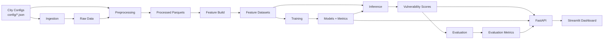

# Urban Flood Vulnerability Forecasting — Multi-City India (2020–2026)

A monthly flood vulnerability forecasting system for Indian cities built on public earth observation, climate reanalysis, terrain, and population signals.
Designed for urban planners, municipal flood preparedness teams, and disaster management agencies.
The system produces **relative vulnerability scores (0–1)**, not flood water depth or inundation maps.

## Why this project exists

Urban flood events across Indian cities cause recurring infrastructure damage and displace residents each monsoon season. Decision-makers lack forward-looking, data-driven tools to prioritize drainage intervention, allocate preparedness resources, and plan preventive action before the rains arrive. This project fills that gap by combining satellite imagery, rainfall data, terrain elevation, built-up surface data, population exposure, and road network density into a monthly vulnerability forecast for four cities.

## Architecture flow




## Core capabilities

- Multi-source monthly data ingestion (Sentinel-1, Sentinel-2, ERA5, DEM, GHSL, WorldPop, OSM)
- Automated preprocessing into per-tile flood stress features on an 8×8 spatial grid
- Temporal regression modeling with lagged and rolling features
- Chronological train/validation/test evaluation (no data leakage)
- Scored vulnerability output with per-tile rankings
- Read-only REST API serving results from generated artifacts
- Interactive Streamlit decision-support dashboard with city selector, risk maps, zone priorities, preparedness trends, scenario simulation, and preventive action engine

## Project at a glance

| Item | Value |
|------|-------|
| **Cities** | Bengaluru, Hyderabad, Mumbai, Pune |
| **Coverage** | April 2020 – July 2026 (64 months per city) |
| **Tiles per city** | 64 (8×8 grid) |
| **Total rows** | 16,384 (4 cities × 64 tiles × 64 months) |
| **Selected model** | `ExtraTreesRegressor` (`extra_trees`) — scikit-learn |
| **Test MAE** | 0.1176 (31.7% improvement over Ridge baseline) |
| **Test R²** | 0.6304 (pooled; varies significantly by city — see [Modeling approach](#per-city-performance)) |
| **Core output** | Relative vulnerability scores (0–1), not flood depth |

## Tech stack

| Component | Technology |
|-----------|------------|
| Language | Python |
| ML framework | scikit-learn |
| Data handling | pandas, numpy, pyarrow |
| Geospatial | rasterio, shapely |
| API | FastAPI, uvicorn |
| Dashboard | Streamlit |
| Model persistence | joblib |
| HTTP client | requests |

## Modeling approach

- **Target:** `target_next_month` — next month's flood risk, derived from threshold-based labeling on low-lying terrain score and rainfall accumulation
- **Baseline model:** Ridge regression (`alpha=1.0`) on 5 raw features — test MAE 0.1722, test R² 0.3392
- **Selected temporal model:** `ExtraTreesRegressor` (`n_estimators=600`, `min_samples_leaf=2`, `criterion=squared_error`, `max_features=1.0`, `bootstrap=false`, `random_state=42`, `n_jobs=1`) — test MAE 0.1176, test R² 0.6304
- **Temporal features:** 5 base features × 4 temporal transforms (lag1, lag2, lag3, roll3) = 25 features total
- **Model selection:** Best validation MAE across 6 candidates (RandomForest ×2, ExtraTrees ×2, HistGBRT ×2)
- **Evaluation:** Spearman rank correlation (0.3278) against monsoon seasonality proxy; high vs low vulnerability gap (0.5971)
- **Chronological split:**
  - Train: through June 2023
  - Validation: July 2023 to June 2024
  - Test: July 2024 to June 2026

### Per-city performance

| City      | MAE    | R²     |
|-----------|--------|--------|
| Bengaluru | 0.1020 | 0.4825 |
| Hyderabad | 0.1167 | 0.7251 |
| Mumbai    | 0.1161 | 0.1752 |
| Pune      | 0.1359 | 0.5465 |

The pooled test R² of 0.6304 conceals substantial per-city variance. The model performs well for Hyderabad and moderately for Bengaluru and Pune, but Mumbai's R² of 0.1752 indicates the pooled model captures little of Mumbai's flood risk signal — likely because Mumbai's flood dynamics differ from the other three cities in ways the shared feature set doesn't capture. This is a known limitation; see `PROJECT_CONTEXT.md` Priority 4 for planned per-city model exploration.

## Data sources

| Source | Signal |
|--------|--------|
| Sentinel-1 / Sentinel-2 | SAR water persistence (product count proxy) |
| ERA5 (Open-Meteo) | Daily rainfall accumulation |
| Copernicus DEM GLO-30 | Low-lying terrain score |
| GHSL (JRC) | Built-up surface reference |
| WorldPop | Population exposure proxy |
| OSM (Overpass) | Road density / impervious change rate |

## Repository structure

```
The-Machine-Learners/
├── config/                     # Per-city JSON configs (bbox, date range, sources)
├── src/
│   ├── common/                 # Settings, time utilities
│   ├── ingestion/              # Source adapters, CDSE client, pipeline
│   ├── preprocessing/          # Raw → processed monthly parquets
│   ├── features/               # Processed → model-ready dataset
│   ├── models/                 # TemporalTrainer (model selection logic)
│   ├── training/               # TrainingPipeline orchestrator
│   ├── inference/              # InferencePipeline (scoring)
│   ├── evaluation/             # EvaluationPipeline (metrics)
│   ├── api/                    # FastAPI application
│   └── frontend/               # Streamlit dashboard
├── scripts/                    # Runnable entrypoints (one per pipeline step)
├── data/
│   ├── raw/                    # Per-city, per-source, per-month raw files
│   ├── processed/              # Monthly parquets (64 rows each)
│   ├── features/               # Model-ready datasets
│   └── results/                # Trained models, metrics, scored output
├── docs/                       # MkDocs documentation pages
├── mkdocs.yml
├── requirements.txt
└── README.md
```

## Quick start

### 1. Install dependencies

```bash
pip install -r requirements.txt
```

### 2. Configure environment

Create a `.env` file (or set environment variables) with:

```
CDS_API_KEY=<your Climate Data Store API key>
CDSE_CLIENT_ID=<your Copernicus Data Space Ecosystem client ID>
CDSE_CLIENT_SECRET=<your Copernicus Data Space Ecosystem client secret>
GEE_PROJECT_ID=<your Google Earth Engine project ID>
```

Optional (frontend only):

```
FLOOD_API_BASE=http://127.0.0.1:8000
```

The Streamlit dashboard reads `FLOOD_API_BASE` and defaults to `http://127.0.0.1:8000` if not set.

### 3. Start the API

```bash
python scripts/run_api.py
```

Runs on `0.0.0.0:8000`.

### 4. Start the dashboard

```bash
python scripts/run_frontend.py
```

## Run the full pipeline

Run all steps for all four cities:

```bash
python scripts/run_ingestion.py --all-default-cities
python scripts/run_preprocessing.py --all-default-cities
python scripts/run_feature_build.py --all-default-cities
python scripts/run_training.py
python scripts/run_inference.py
python scripts/run_evaluation.py
```

## Single-city example

```bash
python scripts/run_ingestion.py --city bengaluru
python scripts/run_preprocessing.py --city bengaluru
python scripts/run_feature_build.py --city bengaluru
python scripts/run_training.py
python scripts/run_inference.py
python scripts/run_evaluation.py
```

Ingestion also supports `--live-fetch` to enable live CDSE API calls for Sentinel sources:

```bash
python scripts/run_ingestion.py --city bengaluru --live-fetch
```

## API endpoints

| Method | Route | Description |
|--------|-------|-------------|
| `GET` | `/vulnerability/latest` | Latest-month tile scores; `?limit=` (default 200, max 10000) |
| `GET` | `/vulnerability/by_zone` | Zone-binned mean scores; `?year_month=&bins_lat=8&bins_lon=8` |
| `GET` | `/vulnerability/timeseries` | Monthly average vulnerability trend |
| `GET` | `/metadata` | Dataset coverage, months, sources, training + evaluation metrics |

All endpoints are read-only over `data/results/`. No model training or inference runs inside request handling.

## Main outputs

### Results (`data/results/`)

| File | Description |
|------|-------------|
| `vulnerability_scores.parquet` | Scored vulnerability output with per-tile rankings |
| `training_metrics.json` | Model selection, training/validation/test metrics |
| `evaluation.json` | Post-inference evaluation (Spearman, high/low gap) |
| `feature_importance.json` | Feature importances (via permutation importance) |
| `models/baseline_model.joblib` | Trained Ridge baseline |
| `models/temporal_model.joblib` | Trained ExtraTreesRegressor |

### Datasets (`data/features/`)

| File | Description |
|------|-------------|
| `flood_dataset_multicity.parquet` | 4-city combined dataset (used for training) |
| `flood_dataset.parquet` | Single-city dataset (Bengaluru only) |

## Documentation

Developer documentation is available in `docs/` with MkDocs configuration in `mkdocs.yml`.

```bash
pip install mkdocs mkdocs-material
mkdocs serve
```

## Notes

- **Relative vulnerability, not hydraulic depth.** Scores represent relative flood stress priority (0–1), not physical water levels. They are intended for planning and preparedness, not for engineering flood simulation.
- **Planning and preparedness use.** The dashboard and API are designed for pre-monsoon prioritization: identifying high-risk zones, estimating exposure, and recommending preventive actions.
- **Dashboard and API consume generated result artifacts.** The API serves data from `data/results/` files. Run the full pipeline before starting the API or dashboard.
- **Multi-city combined dataset.** Training uses `flood_dataset_multicity.parquet` (all four cities pooled) when available; falls back to `flood_dataset.parquet` if the multi-city file is absent.
- **Feature importance is now populated.** `src/models/temporal.py` uses `sklearn.inspection.permutation_importance` to compute feature importance after model selection, which is model-agnostic and works regardless of which candidate algorithm is selected. This resolves the previous limitation where `HistGradientBoostingRegressor` did not expose `feature_importances_`.

### Feature Importance (Top Contributing Features)

| Rank | Feature | Importance |
|------|---------|------------|
| 1 | `rainfall_accumulation_lag3` | 0.2160 |
| 2 | `rainfall_accumulation` | 0.1109 |
| 3 | `rainfall_accumulation_lag1` | 0.1075 |
| 4 | `sar_water_persistence_roll3` | 0.0435 |
| 5 | `low_lying_score_lag2` | 0.0340 |
| 6 | `sar_water_persistence_lag3` | 0.0312 |
| 7 | `low_lying_score` | 0.0310 |

> **Note:** `impervious_change_rate` and its lag variants showed negative or near-zero importance (around −0.002 to −0.006), suggesting this feature contributes little predictive signal in the current model and is a candidate for review or replacement (per existing limitations around proxy features).
